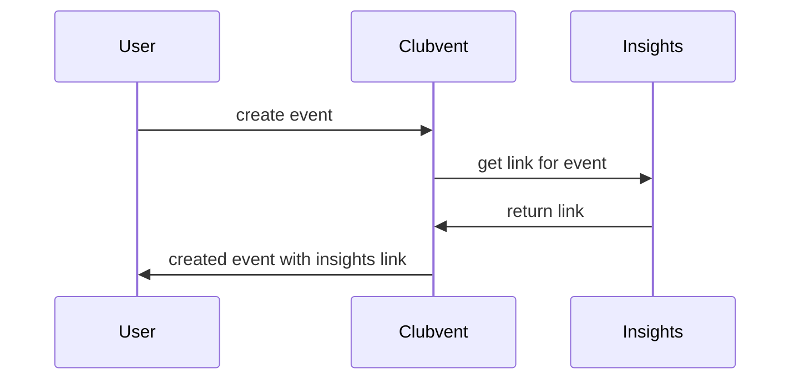
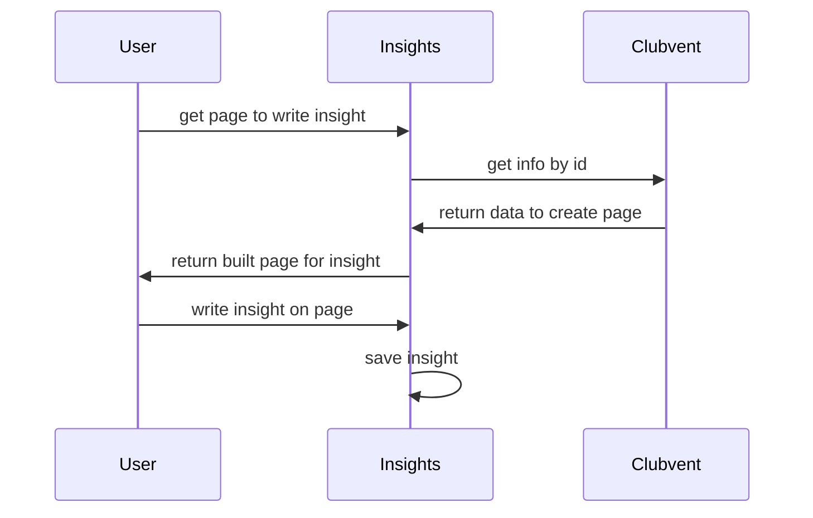
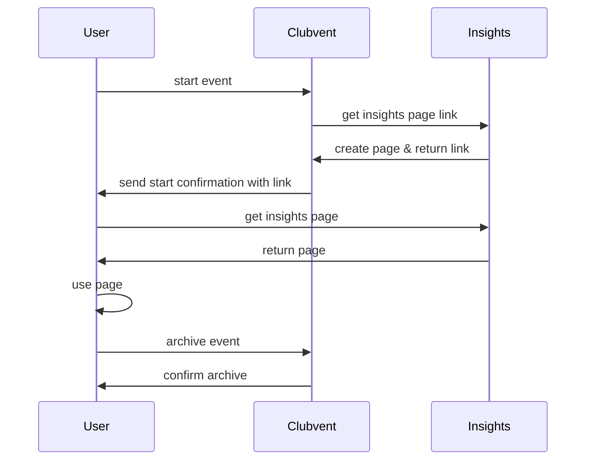

## Phase I. Creating event

```mermaid
sequenceDiagram
    User->>Clubvent: create event
    Clubvent->>Insights: get link for event
    Insights->>Clubvent: return link
    Clubvent->>User: created event with insights link
```

## Phase II. Writing insight

```mermaid
sequenceDiagram
    User->>Insights: get page to write insight
    Insights->>Clubvent: get info by id
    Clubvent->>Insights: return data to create page
    Insights->>User: return built page for insight
    User->>Insights: write insight on page
    Insights->>Insights: save insight
```

## Phase III. Reviewing insights

```mermaid
sequenceDiagram
    User->>Clubvent: start event
    Clubvent->>Insights: get insights page link
    Insights->>Clubvent: create page & return link
    Clubvent->>User: send start confirmation with link
    User->>Insights: get insights page
    Insights->>User: return page
    User->>User: use page
    User->>Clubvent: archive event
    Clubvent->>User: confirm archive
```